  

# AnalystLab Africa — Data Analytics Internship

#### 👨‍💻 Intern: ***Thabiso***
#### 📚 Program: ***8-Week Data Analytics Internship***
#### 📅 Duration: ***01 July 2026 – 01 September 2026***
#### 🏢 Organization: ***AnalystLab Africa***

 

---

# 📖 About

This repository documents my learning journey throughout the **8-Week AnalystLab Africa Data Analytics Internship**.

The internship focuses on developing practical skills in:

- 📊 Data Analysis
- 🧹 Data Cleaning & Preprocessing
- 📈 Exploratory Data Analysis (EDA)
- 📉 Statistics
- 🤖 Machine Learning
- ⚙️ Feature Engineering
- 📦 Model Deployment
- 🎯 Capstone Project

---

# 🛠️ Tech Stack

| Technology | Purpose |
|------------|---------|
| 🐍 Python | Programming Language |
| 🐼 Pandas | Data Manipulation |
| 🔢 NumPy | Numerical Computing |
| 📊 Matplotlib | Data Visualization |
| 🤖 Scikit-Learn | Machine Learning |
| 📓 Jupyter Notebook | Interactive Development |
| 🌿 Git & GitHub | Version Control |

---

# 📁 Project Structure

```mermaid
flowchart TD

    A["📂 Africa-Data-Analytics-Internship"]

    A --> B["📂 datasets"]
    B --> B1["📄 OnlineRetail.csv"]
    B --> B2["📄 netflix_titles.csv"]

    A --> C["📂 Week-01-02"]
    C --> C1["📓 Dataset_Understanding.ipynb"]
    C --> C2["📓 Data_Cleaning.ipynb"]
    C --> C3["📄 Week1_Report.pdf"]

    A --> D["📂 Week-03"]
    D --> D1["📓 Exploratory_Data_Analysis.ipynb"]

    A --> E["📂 Week-04"]
    E --> E1["📓 Data_Visualization.ipynb"]

    A --> F["📂 Week-05"]
    F --> F1["📓 Statistics.ipynb"]

    A --> G["📂 Week-06"]
    G --> G1["📓 SQL_for_Data_Analytics.ipynb"]

    A --> H["📂 Week-07"]
    H --> H1["📓 PowerBI_Dashboard.pbix"]

    A --> I["📂 Week-08"]
    I --> I1["📓 Final_Project.ipynb"]

    A --> J["📂 reports"]
    J --> J1["📄 Weekly Reports"]
    J --> J2["📄 Final Report"]

    A --> K["📂 figures"]
    K --> K1["📊 Charts"]
    K --> K2["📷 Dashboard Screenshots"]

    A --> L["📂 cleaned_data"]
    L --> L1["📄 OnlineRetail_Cleaned.csv"]
    L --> L2["📄 Netflix_Cleaned.csv"]
```

---

# 📅 Weekly Progress

| Week | Topic | Status |
|------|-------|:------:|
| Week 1–2 | Dataset Understanding & Data Cleaning | 🟡 In Progress |
| Week 3 | Statistics | ⏳ Pending |
| Week 4 | Supervised Learning | ⏳ Pending |
| Week 5 | Advanced Machine Learning | ⏳ Pending |
| Week 6 | Feature Engineering | ⏳ Pending |
| Week 7 | Model Deployment | ⏳ Pending |
| Week 8 | Capstone Project | ⏳ Pending |

---

# 🎯 Learning Objectives

- ✅ Understand real-world datasets
- ✅ Clean and preprocess data
- ✅ Perform Exploratory Data Analysis (EDA)
- ✅ Build Machine Learning models
- ✅ Evaluate model performance
- ✅ Communicate insights effectively
- ✅ Strengthen Python programming skills
- ✅ Build a professional data science portfolio

---

# 📈 Repository Goals

This repository serves as a record of my internship work and demonstrates my progress in:

- Python Programming
- Data Wrangling
- Data Visualization
- Statistical Analysis
- Machine Learning
- Feature Engineering
- Version Control with Git & GitHub

---

## AnalystLab Africa

### **Learn • Analyze • Grow**

⭐ *Thank you for visiting this repository!*

